```{r setup, echo = FALSE}
knitr::opts_chunk$set(include = TRUE)
knitr::opts_chunk$set(comment = NA)

xaringanExtra::use_tile_view()
```

```{r jquery, echo=FALSE}
# This is to deal with issues when making slides.
# See: https://github.com/jhelvy/xaringanBuilder/issues/46
htmltools::tagList(rmarkdown::html_dependency_jquery())
```

```{r slides, eval=FALSE, echo=FALSE}
# make pdf of slides
xaringanBuilder::build_pdf("./slides.Rmd")
```

```{r packages, echo=FALSE}
# Helper packages - need dplyr and ggplot
library(conflicted)
conflict_prefer("select", "dplyr", quiet = TRUE)
conflict_prefer("filter", "dplyr", quiet = TRUE)
library(dplyr)
library(tidyr)
library(knitr)
conflict_prefer("continuous_summary", "gtsummary", quiet = TRUE)
conflict_prefer("as_flextable", "gtsummary", quiet = TRUE)
conflict_prefer("void", "reactablefmtr", quiet = TRUE)
```

# Who are we?

+ Francisco - A Ph.D. student at The University of Miami's Miller School of Medicine, quantifying policies to prevent/delay childhood alcohol use. 

The rest of us work at UM:

+ Ray - An Associate Professor of biostatistics (really a data scientist) studying the intersection of HIV, mental health and drug addiction.
+ Lauren - A statistician/data scientist at UM's Sylvester Comprehensive Cancer Center
+ Anna - A data scientist working with Ray on HIV, mental health and addiction

---
# Disclosures

We have no financial disclosures to report.

# License
.small[
This work is licensed under a [Creative Commons Attribution 4.0 International License](https://creativecommons.org/licenses/by/4.0/).
]

---
# General Comments
.small[
+ I use and teach with .blue[`tidyverse`] and .blue[`tidymodels`].  Because not everybody has been able to upgrade to R 4.2, we left  .blue[`%>%`] pipes in this presentation but we strongly suggest that people upgrade and use the most excellent .blue[`|>`] pipe.

+ The slides are done with the .blue[`xaringan`] package.  There is bug somewhere that causes the slides to render quickly but then there is a delay (about a minute) before the details are shown on two of my Macs.  Sorry! If you have the same issue add a comment:
  + https://community.rstudio.com/t/rstudio-miserably-slow-on-os-monterey-when-knitting-xaringan-slides/140183
]

---
## Where did the idea for this talk come from? $_1$

.center[

  
https://vimeo.com/585821837
]

---
## Where did the idea for this talk come from? $_2$

+ When I used to primarily work in SAS, I would get my tables close to correct with *proc whatever* and then export to HTML, tweak things in Excel, and wait for the call saying:

> We are really sorry but there is "this guy"...

+ Of course, every number in the paper, including the tables, would change and I would mutter about needing to learn R. 
+ I learned R Markdown and finally stopped crying whenever my phone would ring.

---
# When I was in school...

+ Journal tables (and figures) were monochrome and simple.
+ Now we have tables that are artfully formatted and have art that is ready for Twitter.
+ The distinction between tables and figures has completely blurred.

.pull-left[
.center[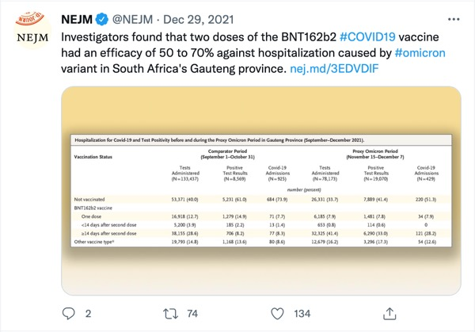]
]

.pull-right[
.center[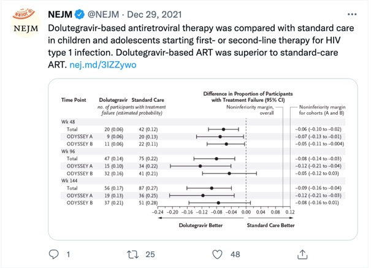]
]

---
# When should you use a table?

+ Tables are useful to show the exact values of your data or estimates.

+ They are not the best solution to show a lot of data or if you want to show the data in a compact space.

+ They are not usually intended to give a quick, visual representation of data.
  + However, the core psychological principles leading to fast and accurate judgment in graphics apply to both charts and tables. 
  + Read/Study/Live *Visualizing Data* and *The Elements of Graphing Data* by William S. Cleveland.

---
class: segue
# Best Practices in Plots (And Graphics)

---
# Tufte on Visualizations
.small[
+ One of the visualization thought leaders in the 1980s, Edward Tufte, stressed the importance of erasing all unnecessary ink from the page.  The same holds true for tables. 
+ When in doubt, erase.

.center[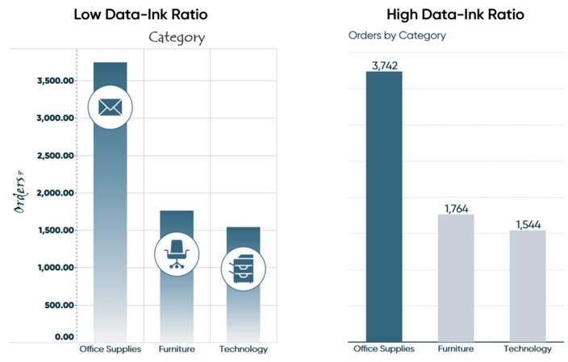]
]

.tiny[https://playfairdata.com/data-ink-ratio-animation-and-how-to-apply-it-in-tableau/]


---
# Gestalt Principles

.pull-left[
Gestalt Law of Proximity - Things close together are automatically grouped.]
.center[
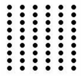
]

.pull-left[Gestalt Law of Similarity - Things of the same color will be grouped.  If one thing is a different color, it will pop off of the page.]
.center[
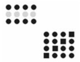
]

.pull-left[

Gestalt Law of Closure - You can draw part of a bounding box and the brain will fill in the rest.]
.center[
<br>

]

.tiny[https://blog.xlcubed.com/2008/05/gestalt-laws-charts-and-tables-the-way-your-brain-wants-them-to-be/]


---
# Schwabish's Rules for Better Tables

.center[
.pull-left[
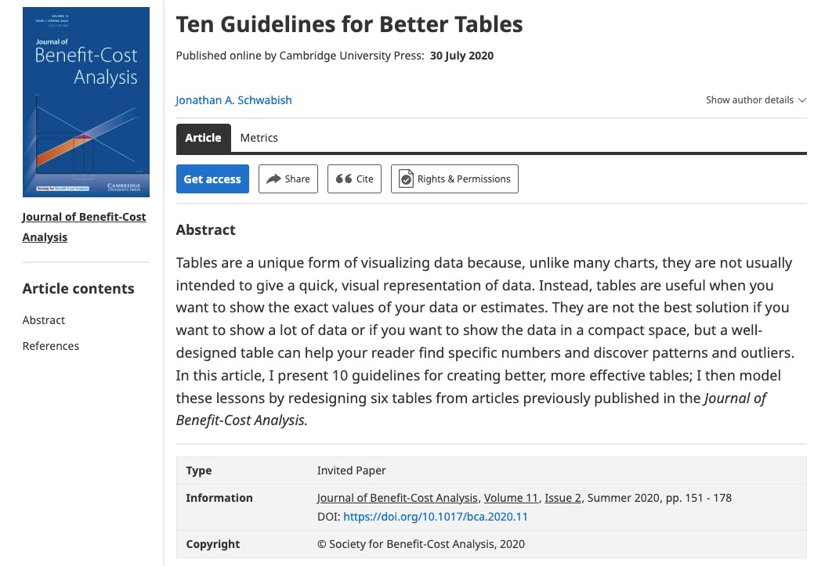
https://doi.org/10.1017/bca.2020.11
]
.pull-right[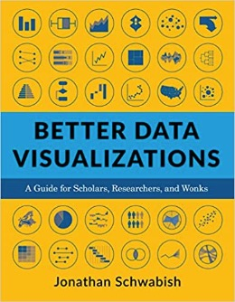
https://cup.columbia.edu/book/better-data-visualizations/9780231193115
]]


---
### Schwabish's Ten Rules for Better Tables + Balise Three
.small[
1. Offset the .red[Heads] from the Body
2. Use .red[Subtle Dividers] Rather Than Heavy Gridlines
3. .red[Right-Align Numbers] and Heads
4. .red[Left-Align Text] and Heads
5. Select the Appropriate Level of .red[Precision]
6. Guide Your Reader with .red[Space] between Rows and Columns
7. .red[Remove] Unit .red[Repetition]
8. Highlight .red[Outliers]
9. .red[Group Similar] Data and Increase White Space
10. Add .red[Visualizations] When Appropriate
11. Draw Attention to the .red[Key Point(s)]
12. Use .red[Annotations] to Explain the Statistics
13. Make .red[Captions/Titles] Self-Contained
  + Explain Sample Size, Who and When
]

.tiny[Schwabish, Jonathan A., Journal of Benefit-Cost Analysis; Berlin Vol. 11, Iss. 2,  (Summer 2020): 151-178. DOI:10.1017/bca.2020.11]

---
# What is the Key Take-Away Point in These Data?

.pull-left[
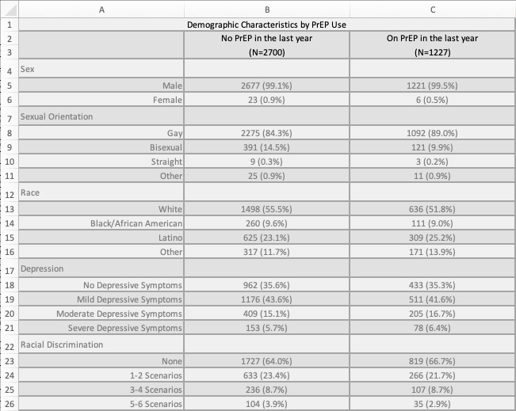
]

--

.pull-left[.center[
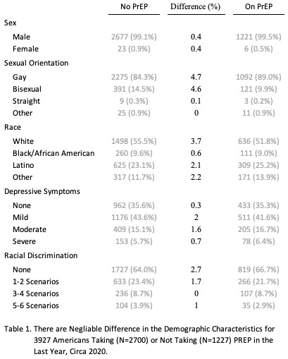
]]

---
# Critique PReP Table 1 - Excel Default

.pull-left[

]

.pull-right[.small[
1. .red[Heads] `r emo::ji("check")`
2. .red[Subtle Dividers] `r emo::ji("x")`
3. .red[Right-Align Numbers] `r emo::ji("x")`
4. .red[Left-Align Text] `r emo::ji("x")`
5. .red[Precision] `r emo::ji("check")`
6. .red[Space] `r emo::ji("check")`
7. .red[Remove Repetition] `r emo::ji("x")`
8. .red[Outliers]
9. .red[Group Similar] `r emo::ji("check")`
10. .red[Visualizations]
11. .red[Key Point(s)] `r emo::ji("x")`
12. .red[Annotations]
13. .red[Caption/Title] `r emo::ji("x")`
]]

---
# Critique PReP Table 1 - Also Excel

.pull-left[

]

.pull-right[.small[
1. .red[Heads] `r emo::ji("check")`
2. .red[Subtle Dividers] `r emo::ji("check")`
3. .red[Right-Align Numbers] `r emo::ji("x")`
4. .red[Left-Align Text] `r emo::ji("check")`
5. .red[Precision] `r emo::ji("check")`
6. .red[Space] `r emo::ji("check")`
7. .red[Remove Repetition] `r emo::ji("x")`
8. .red[Outliers] 
9. .red[Group Similar] `r emo::ji("check")`
10. .red[Visualizations] 
11. .red[Key Point(s)] `r emo::ji("check")`
12. .red[Annotations] 
13. .red[Caption/Title] `r emo::ji("check")`
]]

---
# Critique PReP Table 1 - (Version 1.1)

.pull-left[
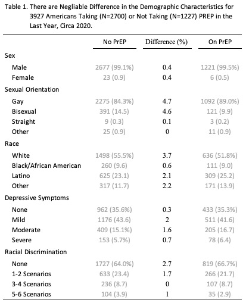
]

.pull-right[.small[
1. .red[Heads] `r emo::ji("check")`
2. .red[Subtle Dividers] `r emo::ji("check")`
3. .red[Right-Align Numbers] `r emo::ji("x")`
4. .red[Left-Align Text] `r emo::ji("check")`
5. .red[Precision] `r emo::ji("check")`
6. .red[Space] `r emo::ji("check")`
7. .red[Remove Repetition] `r emo::ji("check")`
8. .red[Outliers]
9. .red[Group Similar] `r emo::ji("check")`
10. .red[Visualizations]
11. .red[Key Point(s)] `r emo::ji("check")`
12. .red[Annotations]
13. .red[Caption/Title] `r emo::ji("check")`
]]


---
class: segue

# Where We are Going

A Religious Experience  
Playing with Babies  
Fun with Cameras in the Surgical Theater  
What is going on in Florida?

---
# Categorical Data Analysis

.pull-left[
+ One of the best-written statistics books:
*An Introduction to Categorical Data Analysis* by Alan Agresti
]

.pull-right[
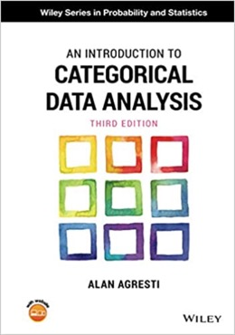
]

https://raymondbalise.github.io/Agresti_IntroToCategorical/
https://github.com/RaymondBalise/Agresti_IntroToCategorical


---
# Good Tables vs. Really???

.pull-left[
The physical book has lovely tables printed on horribly thin paper:
<br><br>
.center[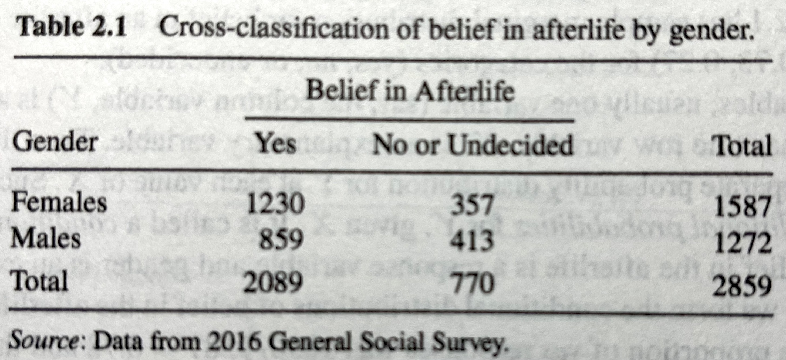]
]
.pull-right[
The online version through the UM library is not beautiful:
<br><br>
.center[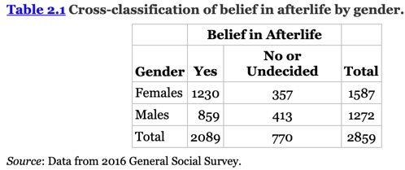]
]


---
# Critique - Agresti Book

.pull-left[
The physical book has lovely tables printed on horribly thin paper:
<br><br>
.center[]
]
.pull-right[.small[
1. .red[Heads] `r emo::ji("check")`
2. .red[Subtle Dividers] `r emo::ji("check")`
3. .red[Right-Align Numbers] `r emo::ji("check")`
4. .red[Left-Align Text] `r emo::ji("check")`
5. .red[Precision] `r emo::ji("check")`
6. .red[Space] `r emo::ji("check")`
7. .red[Remove Repetition] `r emo::ji("check")`
8. .red[Outliers]
9. .red[Group Similar] `r emo::ji("check")`
10. .red[Visualizations]
11. .red[Key Point(s)] `r emo::ji("x")`
12. .red[Annotations] 
13. .red[Caption/Title] `r emo::ji("check")`
]]

---
# Critique - Agresti Online

.pull-left[
The physical book has lovely tables printed on horribly thin paper:
<br><br>
.center[]
]
.pull-right[.small[
1. .red[Heads] `r emo::ji("check")`
2. .red[Subtle Dividers] `r emo::ji("x")`
3. .red[Right-Align Numbers] `r emo::ji("check")`
4. .red[Left-Align Text] `r emo::ji("check")`
5. .red[Precision] `r emo::ji("check")`
6. .red[Space] `r emo::ji("x")`
7. .red[Remove Repetition] `r emo::ji("check")`
8. .red[Outliers]
9. .red[Group Similar] `r emo::ji("check")`
10. .red[Visualizations]
11. .red[Key Point(s)] `r emo::ji("x")`
12. .red[Annotations] 
13. .red[Caption/Title] `r emo::ji("check")`
]]

---
# The .blue[`medicaldata`] Package 

There is a dataset called .blue[`opt`] that has information from a controlled trial looking to see if treatment for periodontal disease can reduce the risk of preterm and low birth weight babies.

.center[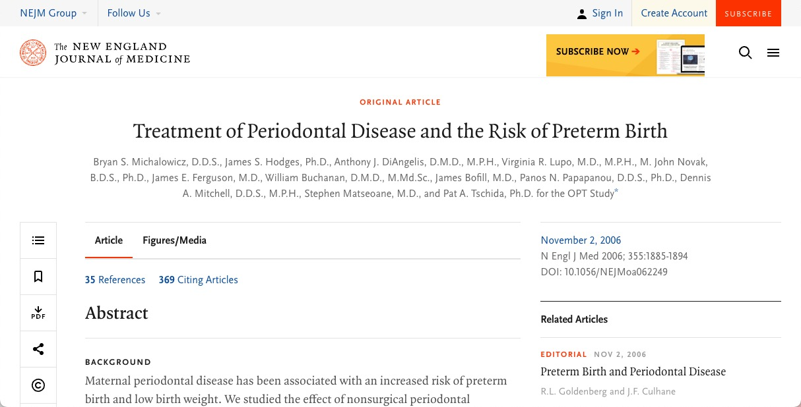]

---
## NEJM Style Table 1
.pull-left-60[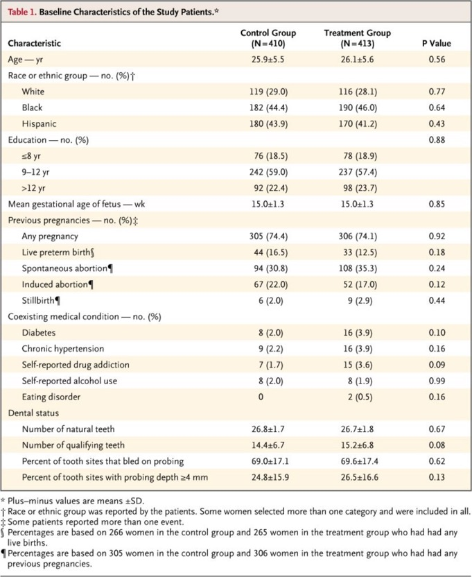]
.pull-left-36[.small[
1. .red[Heads] `r emo::ji("check")`
2. .red[Subtle Dividers] `r emo::ji("check")`
3. .red[Right-Align Numbers] `r emo::ji("check")`
4. .red[Left-Align Text] `r emo::ji("check")`
5. .red[Precision] `r emo::ji("check")`
6. .red[Space] `r emo::ji("check")`
7. .red[Remove Repetition] `r emo::ji("check")`
8. .red[Outliers]
9. .red[Group Similar] `r emo::ji("check")`
10. .red[Visualizations]
11. .red[Key Point(s)] `r emo::ji("x")`
12. .red[Annotations] `r emo::ji("check")`
13. .red[Caption/Title] `r emo::ji("check")`
]]

---
### Device Clinical Trial - Laryngoscope Camera

.pull-left-60[
.center[
  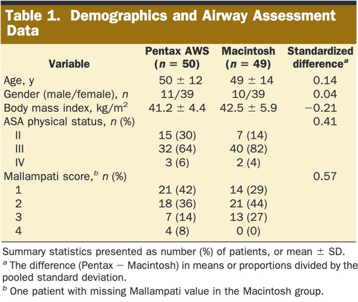
]

* How hard is it to replicate these and/or make an interactive summary?
]
.pull-right-36[.small[
1. .red[Heads] `r emo::ji("check")`
2. .red[Subtle Dividers] `r emo::ji("check")`
3. .red[Right-Align Numbers] `r emo::ji("x")`
4. .red[Left-Align Text] `r emo::ji("check")`
5. .red[Precision] `r emo::ji("check")`
6. .red[Space] `r emo::ji("shrug")`
7. .red[Remove Repetition] `r emo::ji("check")`
8. .red[Outliers]
9. .red[Group Similar] `r emo::ji("check")`
10. .red[Visualizations]
11. .red[Key Point(s)] `r emo::ji("check")`
12. .red[Annotations] `r emo::ji("check")`
13. .red[Caption/Title] `r emo::ji("check")`
]]


---
# What is going on in Florida?

.pull-left[.center[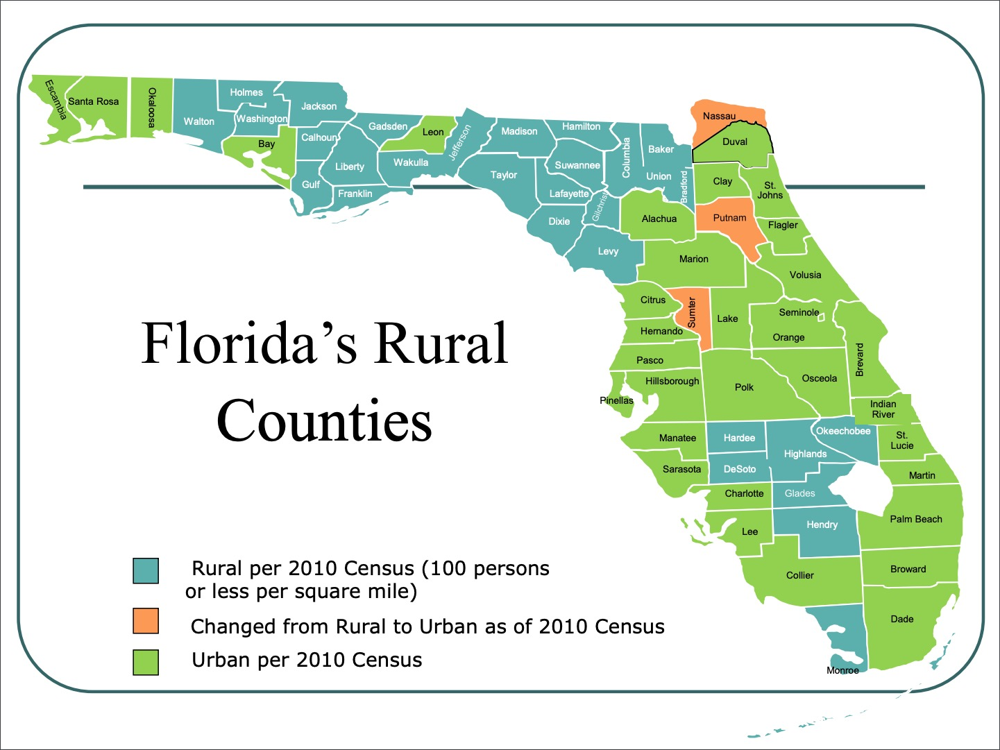]]
.pull-right[.center[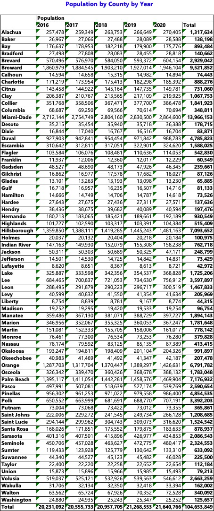]]

.tiny[
https://www.floridahealth.gov/provider-and-partner-resources/community-health-workers/health-professional-shortage-designations/Rural%20Counties%20Map%202016.pdf
https://www.flhealthcharts.gov/FLQUERY_New/Population/Count#
]

---
class: segue

# So Many Tools ... So Little Time

---
# I wish there was a "best" tool.

+ You have a lot of package options for making static (i.e., Word, PDF or HTML) and dynamic (i.e., HTML) publication-ready tables.
+ All packages make web-friendly graphics.
+ Others make static graphics that are beautifully formatted for the the web: .blue[`gt`], .blue[`table1`], .blue[`gtsummary`], .blue[`kableExtra`].
+ Yet others make static tables that look great in Word: .blue[`flextable`].
+ Some are ideal for interactive web content: .blue[`dt`], .blue[`reactable`]

---
# Output for Packages that Make Tables

Not all packages support all R Markdown output formats.
.pull-left-60[
```{r supported, echo=FALSE}

library(gt)

path_figure <- list(
  "img/icons8-smiling-100.png",
  "img/icons8-neutral-100.png",
  "img/icons8-disappointed-100.png",
  "img/icons8-no-entry-100.png",
  "img/icons8-under-construction-100.png",
  "img/icons8-camera-100.png"
)

list(
  printer = c(
    "tibble", "kable", "kableExtra", "gt", "flextable", "huxtable", "dt", "reactable"
  ),
  output = c("HTML", "PDF", "RTF", "Word")
) %>%
  purrr::cross_df() %>%
  dplyr::mutate(
    rating = dplyr::case_when(
      printer == "gt" & output == "HTML" ~ 1, # good output
      printer == "gt" & output %in% c("PDF", "RTF") ~ 5, # under construction
      printer == "gt" & output == "Word" ~ 4, # not supported
      printer == "kable" ~ 2, # okay output
      printer == "flextable" & output != "RTF" ~ 1, # good output
      printer == "flextable" & output == "RTF" ~ 4, # not supported
      printer == "kableExtra" & output %in% c("PDF", "HTML") ~ 1, # good output
      printer == "kableExtra" & output %in% c("RTF", "Word") ~ 4, # not supported
      printer == "huxtable" ~ 1, # good output
      printer == "tibble" ~ 3, # not great
      printer == "reactable" & output == "HTML" ~ 1, # good output
      printer == "reactable" & output %in% c("RTF", "Word") ~ 4, # not supported
      printer == "reactable" & output == "PDF" ~ 6, # picture
      printer == "dt" & output == "HTML" ~ 1, # good output
      printer == "dt" & output == "PDF" ~ 6, # picture
      printer == "dt" & output %in% c("RTF", "Word") ~ 4, # not supported
    ) %>%
      factor()
  ) %>%
  tidyr::pivot_wider(id_cols = printer, names_from = output, values_from = rating) %>%
  dplyr::mutate(
    link = dplyr::case_when(
      printer == "gt" ~
        "[gt](https://gt.rstudio.com/index.html)",
      printer == "kable" ~
        "[kable](https://bookdown.org/yihui/rmarkdown-cookbook/kable.html)",
      printer == "flextable" ~
        "[flextable](https://davidgohel.github.io/flextable/articles/overview.html)",
      printer == "kableExtra" ~
        "[kableExtra](http://haozhu233.github.io/kableExtra/)",
      printer == "huxtable" ~
        "[huxtable](https://hughjonesd.github.io/huxtable/)",
      printer == "tibble" ~
        "[tibble](https://tibble.tidyverse.org/)",
      printer == "reactable" ~
        "[reactable](https://glin.github.io/reactable/index.html)",
      printer == "dt" ~
        "[DT](https://rstudio.github.io/DT/)"
    ),
    fns = dplyr::case_when(
      printer == "gt" ~ "`gt()`",
      printer == "kable" ~ "`kable()`",
      printer == "flextable" ~ "`flextable()`",
      printer == "kableExtra" ~ "`kbl() + stuff`",
      printer == "huxtable" ~ "`huxtable()`",
      printer == "tibble" ~ "`tibble()`",
      printer == "reactable" ~ "`reactable()`",
      printer == "dt" ~ "`datatable()`",
    )
  ) %>%
  gt() %>%
  cols_move_to_start(columns = c(link, fns)) %>%
  cols_hide(columns = c(printer)) %>%
  cols_label(
    link = md("**Print Engine**"),
    fns = md("**Function**"),
    HTML = md("**HTML**"), PDF = md("**PDF**"),
    RTF = md("**RTF**"), Word = md("**Word**")
  ) %>%
  fmt_markdown(columns = c(fns, link)) %>%
  data_color(
    columns = c(HTML, PDF, RTF, Word),
    colors = scales::col_factor(
      palette = c(
        "#D1B3F9", "#bae1ff", "#ffb3ba", "#ffdfba", "#ffffba", "#baffc9"
      ),
      domain = NULL,
      reverse = TRUE
    ),
    alpha = 0.8
  ) %>%
  text_transform(
    locations = cells_body(columns = c(HTML, PDF, RTF, Word)),
    fn = function(x) {
      dplyr::case_when(
        x == 1 ~ local_image(filename = path_figure[[1]]),
        x == 2 ~ local_image(filename = path_figure[[2]]),
        x == 3 ~ local_image(filename = path_figure[[3]]),
        x == 4 ~ local_image(filename = path_figure[[4]]),
        x == 5 ~ local_image(filename = path_figure[[5]]),
        x == 6 ~ local_image(filename = path_figure[[6]])
      )
    }
  ) %>%
  cols_width(
    c(HTML, PDF, RTF, Word) ~ px(60),
    c(link) ~ px(110),
    c(link, fns) ~ px(200)
  )
```
]

.pull-right-36[
```{r supported-key, echo=FALSE}
tibble::tibble(
  figure = 1:6,
  desc = c(
    "Output fully supported",
    "Formatted output, but missing indentation, footnotes, spanning headers",
    "No formatted output",
    "Output not supported",
    "Under development",
    "Image of first page with controls"
  )
) %>%
  gt() %>%
  cols_label(figure = md("**Key**"), desc = "") %>%
  data_color(
    columns = c(figure),
    colors = scales::col_factor(
      palette = c(
        "#D1B3F9", "#bae1ff", "#ffb3ba", "#ffdfba", "#ffffba", "#baffc9"
      ),
      domain = NULL,
      reverse = TRUE
    ),
    alpha = 0.8
  ) %>%
  text_transform(
    locations = cells_body(columns = c(figure)),
    fn = function(x) {
      dplyr::case_when(
        x == 1 ~ local_image(filename = path_figure[[1]], height = 20),
        x == 2 ~ local_image(filename = path_figure[[2]], height = 20),
        x == 3 ~ local_image(filename = path_figure[[3]], height = 20),
        x == 4 ~ local_image(filename = path_figure[[4]], height = 20),
        x == 5 ~ local_image(filename = path_figure[[5]], height = 20),
        x == 6 ~ local_image(filename = path_figure[[6]], height = 20),
      )
    }
  ) %>%
  tab_options(table.font.size = "x-small", data_row.padding = px(3))
```
  
.tiny[.center[Thanks to Daniel D. Sjoberg for the table code.]]

.pull-down[.tinyRight[
Icons from [icons8](https://icons8.com/)]]
]

---
class: segue

# Make a Table

When You Already Have Preprocessed the Data

A religious experience...

---
# Categorical Data Analysis

.pull-left[
+ *An Introduction to Categorical Data Analysis* by Alan Agresti has solid SAS code.
+ A couple years ago, I decided to try to replicate everything in R.  

.center[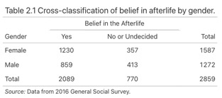]
]

.pull-right[

]


---
# Agresti in R

+ This is quick code for exploratory data analysis but we can do a lot better.  

```{r old-table, comment=NA, echo=TRUE, eval=FALSE}
table2_1 <- data.frame(
  Gender = c("Female", "Female", "Male", "Male"),
  Belief = c(" Yes", "No", " Yes", "No"),
  Count = c(1230, 357, 859, 413)
)

addmargins(xtabs(Count ~ Gender + Belief, table2_1))
```

.pull-left-60[.center[
```{r old-table-output, echo=FALSE}
table2_1 <- data.frame(
  Gender = c("Female", "Female", "Male", "Male"),
  Belief = c(" Yes", "No", " Yes", "No"),
  Count = c(1230, 357, 859, 413)
)

addmargins(xtabs(Count ~ Gender + Belief, table2_1))
```
]]

Notice that I used a space before "Y" in "Yes" to set the order.

---
# .blue[`tibble`] - Not Exactly Publication Ready....

```{r new-table-2-1, eval=FALSE}
`Table 2.1` <-
  xtabs(Count ~ Gender + Belief, table2_1) %>%
  addmargins() %>%
  as_tibble()

`Table 2.1`
```
.center[
```{r new-table-2-1-output, echo=FALSE}
`Table 2.1` <-
  xtabs(Count ~ Gender + Belief, table2_1) %>%
  addmargins() %>%
  as_tibble()

`Table 2.1`
```
]

---
# Pivot to Make a Table Wide - .blue[`tibble`] `r gt::local_image(filename = path_figure[[3]])`

The `Table 2.1` data set was saved with .blue[`as_tibble()`].
```{r make-wide}
wide <-
  `Table 2.1` %>%
  pivot_wider(id_cols = Gender, names_from = Belief, values_from = n) %>%
  mutate(
    Gender = if_else(Gender == "Sum", "Total", Gender)
  ) %>%
  rename(
    Yes = ` Yes`,
    # I could also do: `No or Undecided` = No,
    Total = Sum
  )
wide
```

---
# .blue[`knitr::kable()`] `r gt::local_image(filename = path_figure[[2]])`

+ Drop that tibble into .blue[`kable()`] and add on pretty column names with the .blue[col.names=] argument.

```{r kable-show, eval=FALSE}
wide %>%
  kable(
    col.names = c("Gender", "Yes", "No or Undecided", "Total")
  )
```

.center[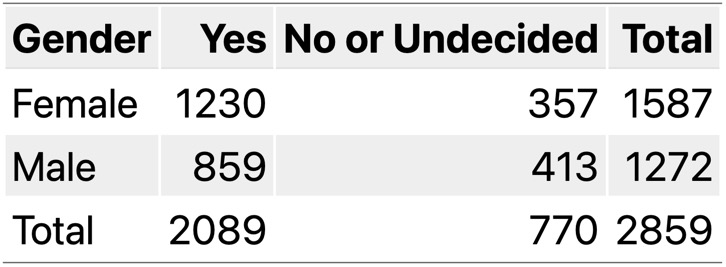]

Not bad...

---
# .blue[`kableExtra::kbl()`] + stuff

```{r kable-code, echo=FALSE}
if ("flextable" %in% (.packages())) {
  detach("package:flextable", unload = TRUE)
}
```


```{r kableExtra, eval=FALSE}
library(kableExtra)
wide %>%
  kbl(
    col.names = c("Gender", "Yes", "No or Undecided", "Total"),
    align = c("l", "r", "c", "r")
  ) %>%
  add_header_above(c(" ", "Belief in Afterlife" = 2, " ")) %>%
  column_spec(3, width = "10em") %>% # make the 3rd column extra wide
  footnote(
    general = "Data from 2016 General Social Survey.",
    general_title = "Source: ",
    footnote_as_chunk = T, title_format = c("italic")
  )
```

.center[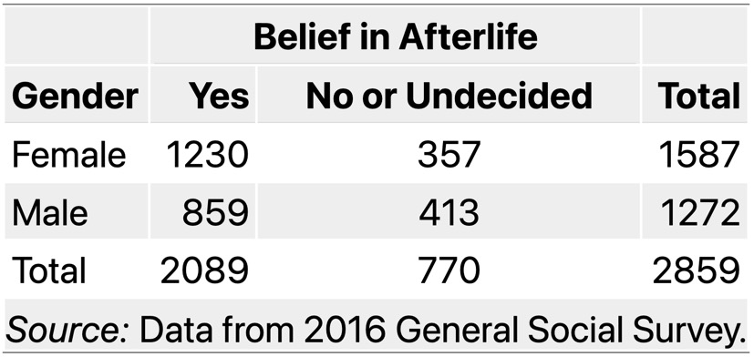]

Closer, but not good...


---
# Add Some CSS

+ I am using the `xaringan` package to render slides, so I need a small tweak.
+ Web page formatting is done with CSS.  Here I am adding instructions for things tagged as being in a table. I need to set them to have a white background.


---
# Adding CSS

.center[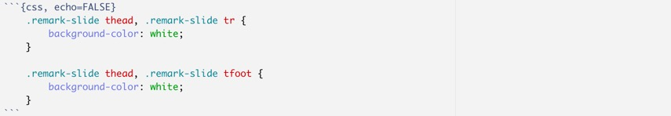]

```{css, echo=FALSE, eval=TRUE}
    .remark-slide thead, .remark-slide tr {
        background-color: white;
    }
    
    .remark-slide thead, .remark-slide tfoot {
        background-color: white;
    }
```

```{r kableExtra-show, eval=FALSE}
library(kableExtra)
wide %>%
  kbl(
    col.names = c("Gender", "Yes", "No or Undecided", "Total"),
    align = c("l", "r", "c", "r")
  ) %>%
  add_header_above(c(" ", "Belief in Afterlife" = 2, " ")) %>%
  column_spec(3, width = "10em") %>%
  footnote(
    general = "Data from 2016 General Social Survey.",
    general_title = "Source: ",
    footnote_as_chunk = T, title_format = c("italic")
  )
```


---
# Close to Perfect - .blue[`kableExtra`] `r gt::local_image(filename = path_figure[[1]])`
.small[

```{css, echo=F}
.remark-slide thead, .remark-slide tr:nth-child(2n) {
    background-color: white;
}

.remark-slide thead, .remark-slide tfoot {
    background-color: white;
}
```

```{r kableExtra-run, echo=FALSE}
suppressPackageStartupMessages(library(kableExtra)) 
wide %>%
  kbl(
    col.names = c("Gender", "Yes", "No or Undecided", "Total"),
    align = c("l", "r", "c", "r")
  ) %>%
  add_header_above(c(" ", "Belief in Afterlife" = 2, " ")) %>%
  column_spec(3, width = "10em") %>%
  footnote(
    general = "Data from 2016 General Social Survey.",
    general_title = "Source: ",
    footnote_as_chunk = T, title_format = c("italic")
  )

detach("package:kableExtra", unload = TRUE)
```
]

---
# How did I figure that out?

+ The .blue[`kableExtra`] documentation does not show the striping behavior...  
+ So I tried to simplify.
+ I copied the code into a vanilla HTML R Markdown file.
  + It didn't include the stripes.
+ I did a Google search for .blue[`xaringan kableExtra`] formatting
  + It led me to this post which included the CSS: 
.small[.center[https://stackoverflow.com/questions/55319141/xaringan-kableextrakable-styling-and-wider-tables]]
+ StackOverflow is your friend.  
+ To learn how to find CSS elements, watch this:
.small[
.center[https://medium.com/@HadrienD/how-to-customize-font-size-in-r-markdown-documents-f5adff36e2cc]]

---
# .blue[`gt::gt()`]

+ RStudio has been working on GT for years...

```{r gt-basic}
library(gt)
wide %>%
  gt()
```

---
# .blue[`gt::gt()`] Code Duplicates the Book $_1$ `r gt::local_image(filename = path_figure[[1]])`

```{r gt-show, eval=FALSE}
library(gt)
wide %>%
  gt() %>%
  tab_header(
    title = "Table 2.1 Cross-classification of belief in afterlife by gender."
  ) %>%
  tab_spanner(
    label = "Belief in the Afterlife",
    columns = 2:3
  ) %>%
  tab_source_note(
    source_note = "<em>Source:</em> Data from 2016 General Social Survey."
  ) %>%
  tab_options(
    table_body.hlines.color = "white",
    table_body.border.bottom.color = "#D3D3D3",
    table.border.bottom.color = "white"
  )
```

---
# .blue[`gt::gt()`] Code Duplicates the Book $_2$ `r gt::local_image(filename = path_figure[[1]])`

.center[]

```{r gt-code, eval=TRUE, echo=FALSE}
library(gt)
wide %>%
  gt() %>%
  tab_header(
    title = "Table 2.1 Cross-classification of belief in afterlife by gender."
  ) %>%
  tab_spanner(
    label = "Belief in the Afterlife",
    columns = 2:3
  ) %>%
  cols_align(
    align = "center",
    columns = c(Yes, No)
  ) %>%
  cols_label(
    No = md("No or Undecided")
  ) %>%
  tab_source_note(
    source_note = "<em>Source:</em> Data from 2016 General Social Survey."
  ) %>%
  tab_options(
    table_body.hlines.color = "white",
    table_body.border.bottom.color = "#D3D3D3",
    table.border.bottom.color = "white",
    table.border.top.color = "white"
  )
```

---
# GT and Word
.pull-left-60[
+ People have been asking for a direct export into Word for *years*.
+ Currently, you get nothing when you knit. `r emo::ji("angry_face")`
+ You can copy and paste GT tables from HTML output into a Word file.  `r emo::ji("nauseated_face")`
+ I hope something in Quarto is going to fix it. `r emo::ji("pray")`
]
.pull-right-36[
.center[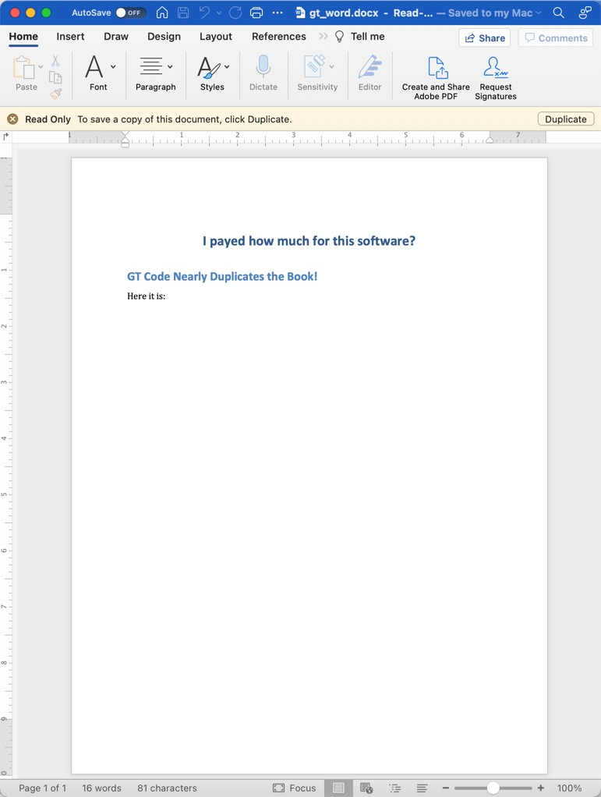]
]

---
# Clean Exports into Word

I know of two options:

+ The .blue[`flextable`] package is what I have used for hardcore tables.
  + I have been using it for years and I still think it is work.
  + Search my Agresti notes on GitHub for examples: https://github.com/RaymondBalise/Agresti_IntroToCategorical
  + https://ardata-fr.github.io/flextable-book/index.html
+ I discovered the .blue[`huxtable`] package in 2022 and I am exploring it.

---
# .blue[`flextable::flextable()`] $_1$

+ The weird thing is that you will want to specify the header first.  
+ Add a value for every variable/column in every row of the header.  
+ If you put the same words into multiple rows (like "Gender" and "Total" in the example below), the values can be merged  later with .blue[`merge_*()`] commands.

```{r flex-head}
suppressPackageStartupMessages(library(flextable))

my_header <- data.frame(
  col_keys = colnames(wide),
  line1 = c("Gender", rep("Belief in the Afterlife", 2), "Total"),
  # line2 is Gender,        Yes, No,                      Total
  line2 = colnames(wide)
)
```


---
# .blue[`flextable::flextable()`] $_2$
.small[
+ You specify the columns using the `col_keys` that you previously defined in the data frame and then tell it to use the data frame to make the columns.
+ Notice the merging of the cells with identical content in the header.
+ Column 1 (Gender) will be left-aligned. The rest of the columns are centered.  Sadly, .blue[`flextable`]  can not decimal-align.
]
```{r flex-show, eval=FALSE}
wide %>%
  flextable(col_keys = my_header$col_keys) %>%
  set_header_df(
    mapping = my_header,
    key = "col_keys"
  ) %>%
  theme_booktabs() %>%
  autofit(part = "all") %>%
  align_nottext_col(align = "center") %>%
  merge_h(part = "header") %>%
  merge_v(part = "header") %>%
  set_caption(caption = "Table 2.1 Cross-classification of belief in afterlife by gender.") %>%
  add_footer_lines(values = "Source: Data from 2016 General Social Survey.")
```

---
# .blue[`flextable::flextable()`] $_3$

```{r flex-code, echo=FALSE}
wide %>%
  flextable(col_keys = my_header$col_keys) %>%
  set_header_df(
    mapping = my_header,
    key = "col_keys"
  ) %>%
  theme_booktabs() %>%
  autofit(part = "all") %>%
  align_nottext_col(align = "center") %>%
  merge_h(part = "header") %>%
  merge_v(part = "header") %>%
  set_caption(caption = "Table 2.1 Cross-classification of belief in afterlife by gender.") %>%
  add_footer_lines(values = "Source: Data from 2016 General Social Survey.")
```

```{r flex-unload, echo=FALSE}
# footnote conflicts with kableExtra
detach("package:flextable", unload = TRUE)
```

+ Unfortunately, the numbers are not decimal-aligned.

---
# .blue[`flextable::flextable()`] Demo

```{r flex-demo-packages, include=FALSE}
# load packages
library(medicaldata)

library(gtable)
library(gt)
library(gtsummary)
library(flextable)

library(dplyr)
library(conflicted)

library(labelled)
library(gdtools)
library(officer)

library(flipbookr)
```

`r suppressMessages(chunk_reveal("my_flex"))`

---

```{r my_flex, include = FALSE}
wide

my_header <- data.frame(
  col_keys = colnames(wide),
  line1 = c("Gender", rep("Belief in the Afterlife", 2), "Total"),
  # line2 is   Gender,             Yes, No,                 Total
  line2 = colnames(wide)
)

my_header

wide %>%
  flextable(col_keys = my_header$col_keys) %>%
  set_header_df(
    mapping = my_header,
    key = "col_keys"
  ) %>%
  theme_booktabs() %>%
  autofit(part = "all") %>%
  align_nottext_col(align = "center") %>%
  merge_h(part = "header") %>%
  merge_v(part = "header") %>%
  set_caption(caption = "Table 2.1 Cross-classification of belief in afterlife by gender.") %>%
  add_footer_lines(values = "Source: Data from 2016 General Social Survey.")
```

---
# .blue[`flextable::flextable()`] $_4$

.pull-left[
+ The export to Word is cleaner than the rendering in the slides.
+ Notice that it will automatically number the tables.
]

.pull-right[
.center[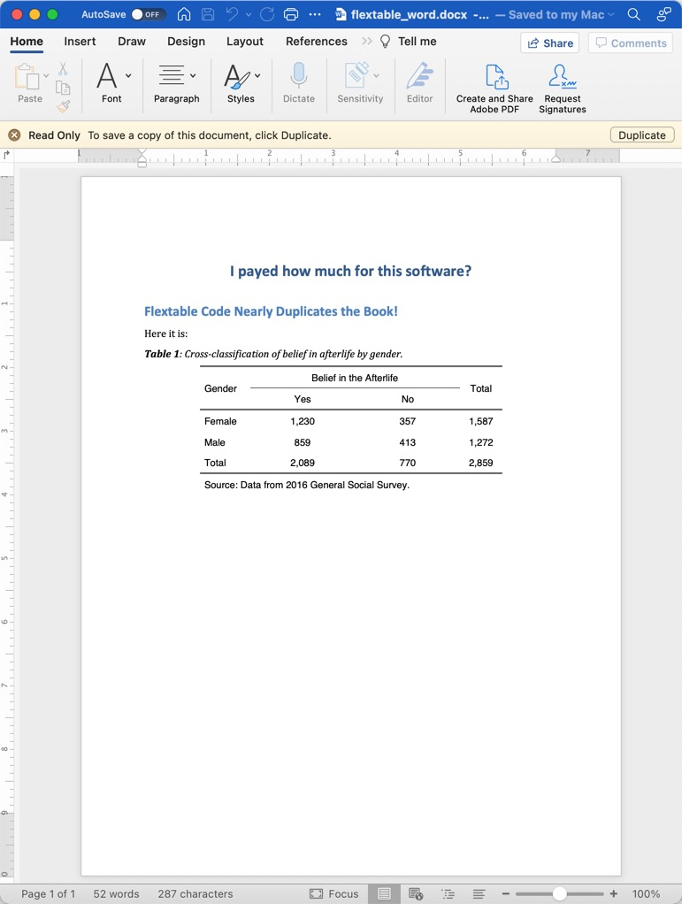]
]

---

class:segue

# Calculate Statistics for a Table on the Fly

Playing with Babies

---
# The Most Impactful Tables in Medicine

.pull-left[
Each New England Journal of Medicine article gets cited something like 75 times and it has a weekly readership in excess of 600,000. Their tables are all over the twitterverse. 

The .blue[`medicaldata`] package has data from *Michalowicz et al., 'Treatment of periodontal disease and the risk of preterm birth', N Engl J Med 2006; 355:1885-1894. DOI: 10.1056/NEJMoa062249*
]

.pull-right[
.center[]
]
.tiny[https://www.kolabtree.com/blog/top-20-medical-journals-for-physicians-to-publish-in/]

---
# In Table 1 (Typically Demographics)

.pull-left[
+ Biostatisticians talk about: 
  + Nominal - Alive/Dead
  + Ordinal - Small, Medium, Large
  + Interval/Ratio - Numbers
  + Time to Event - Survival
+ Where do not mutually exclusive categories fit?
  + Notice Race and Ethnicity are mixed.
+ Why are their p-values here?
  + What comparisons are done?
]
.pull-right[
.center[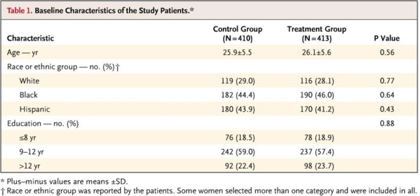]
]

---
# In Table 1 (*P*-Values)

.pull-left[
+ Age - Numeric
+ Race - Each category is distinct
+ Education - Categorical
+ It would have been nice to know what tests were done here...
]
.pull-right[
.center[]
]

---
# When I Do Exploratory Data Analysis (EDA)

.pull-left-60[
+ I start with .blue[`skimr::skim()`].
+ I quickly move to the .blue[`table1`] package.
  + Excellent out of the box behavior!
  + It does not do well on the *remove unit repetition* criteria. 

```{r table1, eval=FALSE}
opt_df <- medicaldata::opt %>%
  select(Age, Black, White, Hisp, Education, Group)

library(table1)
table1(~ . | Group, data = opt_df, overall = FALSE)  #<<
```
]

```{css, echo=FALSE, eval=TRUE}
.remark-slide thead, .remark-slide tr {
  background-color: white;
}
    
.remark-slide thead, .remark-slide tfoot {
  background-color: white;
}

.remark-slide thead, .remark-slide tr:nth-child(2n) {
  background-color: white;
}

.remark-slide thead, .remark-slide tfoot {
  background-color: white;
}
```

.pull-right-36[
```{r table1-code, echo=FALSE}
opt_df <- medicaldata::opt %>%
  select(Age, Black, White, Hisp, Education, Group)

library(table1)
table1(~ . | Group, data = opt_df, overall = FALSE)
```
]

---
# Process a Couple of Variables

```{r drop-level}
make_logical <- function(x) {
  as.logical(x == "Yes") # Combine no and missing ... ummmm.
}

opt_data <-
  as_tibble(medicaldata::opt) %>%
  mutate(
    Group = case_when(
      Group == "C" ~ "Control Group",
      Group == "T" ~ "Treatment Group"
    )
  ) %>%
  mutate(
    `Education (yrs)` = case_when(
      Education == "LT 8 yrs " ~ "≤8",
      Education == "8-12 yrs " ~ "9-12",
      Education == "MT 12 yrs" ~ ">12"
    ),
    `Education (yrs)` = factor(`Education (yrs)`, levels = c("≤8", "9-12", ">12"))
  ) %>%
  mutate(across(c(Black, White, Hisp), make_logical)) %>%
  select(
    Age, Black, White, Hisp, `Education (yrs)`, Group
  )
```

---
# .blue[`{table1}`] For Quick, Presentable Tables
.small[
.pull-left-60[
```{r table1-quick}
library(table1)
table1(~ . | Group, data = opt_data, overall = FALSE)
```
]

.pull-right-36[.small[
1. .red[Heads] `r emo::ji("check")`
2. .red[Dividers] `r emo::ji("check")`
3. .red[Right-Align Numbers] `r emo::ji("x")`
4. .red[Left-Align Text] `r emo::ji("check")`
5. .red[Precision] `r emo::ji("check")`
6. .red[Space] `r emo::ji("check")`
7. .red[Remove Repetition] `r emo::ji("x")`
8. .red[Outliers]
9. .red[Group Similar] `r emo::ji("check")`
10. .red[Visualizations]
11. .red[Key Point(s)] 
12. .red[Annotations]
13. .red[Caption/Title] `r emo::ji("check")`
]]
]

---
# Drop a Binary Level

+ If you only want to show a single level of binary factor, you can tweak the render function. Be careful because this masks missing data (like in the NEJM article).

.small[
```{r table1-drop, eval=FALSE}
# https://github.com/benjaminrich/table1/issues/48
rndr <- function(x, ...) {
  y <- render.default(x, ...)
  if (is.logical(x)) y[2] else y
}

table1(~ . | Group, data = opt_data, overall = FALSE, render = rndr)
```

<center>
```{r echo=FALSE}
# https://github.com/benjaminrich/table1/issues/48
rndr <- function(x, ...) {
  y <- render.default(x, ...)
  if (is.logical(x)) y[2] else y
}

table1(~ . | Group, data = opt_data, overall = FALSE, render = rndr)
```
</center>
]

---
# .blue[`table1::table1()`]

+ If you don't need to add subheaders (like over Race/Ethnicity here) and you don't need p-values, the .blue[`table1`]  package is ideal.
+ The author is wonderfully quick to answer questions.

---
## The .blue[`gtsummary`] Package is Ridiculously Great

.pull-left[
+ The .blue[`table1`] package gives a quick, excellent summary but use .blue[`{gtsummary}`] when you want to include inferential statistics (p-values and confidence limits).

```{r, warning=FALSE, message=FALSE, eval=FALSE}
suppressMessages(library(gtsummary)) #<<

reset_gtsummary_theme()  #<<
suppressMessages(theme_gtsummary_compact())  #<<

opt_data %>%
  select(
    Age, Black, White, Hisp,
    `Education (yrs)`, Group
  ) %>%
  tbl_summary(by = Group) %>% #<<
  add_p() #<<
```
]

.pull-right[
```{r, warning=FALSE, message=FALSE, echo=FALSE}
suppressMessages(library(gtsummary))

reset_gtsummary_theme()
suppressMessages(theme_gtsummary_compact())

opt_data %>%
  select(
    Age, Black, White, Hisp,
    `Education (yrs)`, Group
  ) %>%
  tbl_summary(by = Group) %>% #<<
  add_p() #<<
```
]

---
# Tweaking the Display Details is Easy
.pull-left[
```{r, warning=FALSE, message=FALSE, eval=FALSE}
suppressMessages(library(gtsummary))

reset_gtsummary_theme()
suppressMessages(theme_gtsummary_compact())

opt_data %>%
  select(
    Age, Black, White, Hisp,
    `Education (yrs)`, Group
  ) %>%
  # show mean to 1 decimal place and SD to 2 decimals
  tbl_summary(
    by = Group,
    digits = list(
      all_continuous() ~ c(1, 2, 2), #<<
      all_categorical() ~ c(0, 1) #<<
    )
  ) %>%
  add_p()
```
]

.pull-right[
```{r, warning=FALSE, message=FALSE, echo=FALSE}
suppressMessages(library(gtsummary))

reset_gtsummary_theme()
suppressMessages(theme_gtsummary_compact())

opt_data %>%
  select(
    Age, Black, White, Hisp,
    `Education (yrs)`, Group
  ) %>%
  # show mean to 1 decimal place and SD to 2 decimals
  tbl_summary(
    by = Group,
    digits = list(
      all_continuous() ~ c(1, 2, 2),
      all_categorical() ~ c(0, 1)
    )
  ) %>%
  add_p()
```
]


---
#Adding Subgroups is Not Too Bad

.pull-left[
```{r, warning=FALSE, message=FALSE, eval=FALSE}
suppressMessages(library(gtsummary))

reset_gtsummary_theme()
suppressMessages(theme_gtsummary_compact())

t1 <- opt_data %>%
  select(Age, `Education (yrs)`, Group) %>%
  tbl_summary(by = Group) %>%
  bold_labels() %>% #<<
  add_p()

t2 <- opt_data %>%
  select(Black, White, Hisp, Group) %>%
  tbl_summary(by = Group) %>%
  bold_labels() %>% #<<
  add_p()

tbl_stack(#<<
  list(t1, t2),  #<<
  group_header = c(" ", "Race/Ethnicity") #<<
) #<<
```
]
.pull-right[
```{r, warning=FALSE, message=FALSE, echo=FALSE}
suppressMessages(library(gtsummary))

reset_gtsummary_theme()
suppressMessages(theme_gtsummary_compact())

t1 <- opt_data %>%
  select(Age, `Education (yrs)`, Group) %>%
  tbl_summary(by = Group) %>%
  bold_labels() %>%
  add_p()

t2 <- opt_data %>%
  select(Black, White, Hisp, Group) %>%
  tbl_summary(by = Group) %>%
  bold_labels() %>%
  add_p()

tbl_stack(
  list(t1, t2),
  group_header = c(" ", "Race/Ethnicity")
)
```
]

---
### The vignettes for the .blue[`gtsummary`] package are extraordinary.

.center[
https://www.danieldsjoberg.com/gtsummary/index.html

.small[
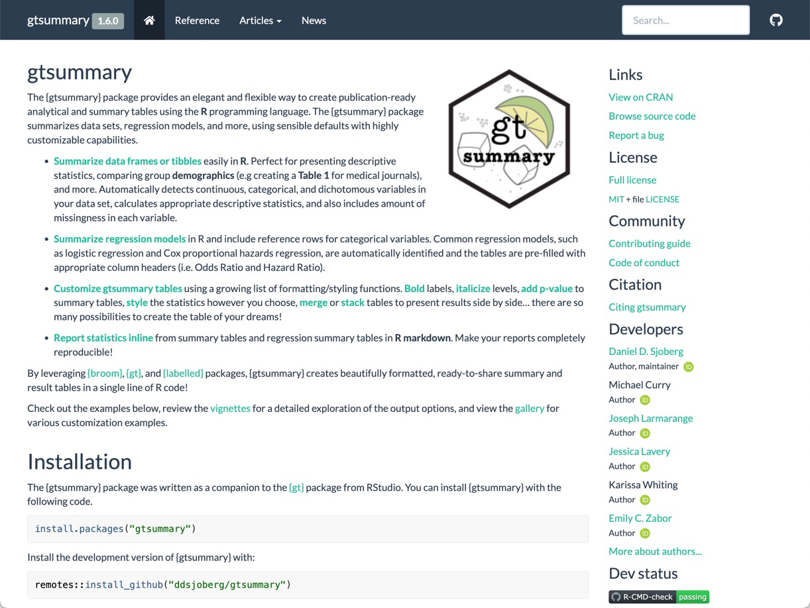]

https://www.danieldsjoberg.com/gtsummary/articles/tbl_summary.html
https://www.danieldsjoberg.com/gtsummary/articles/gallery.html
]

---
class:segue

Surgical Outcomes and Bartending with R...

gt + gtsummary + flextable + rUM

---
# Remember that .blue[`laryngoscope`] data?

+ The online version of the publication has this (blurry) static image made from the table. 

.center[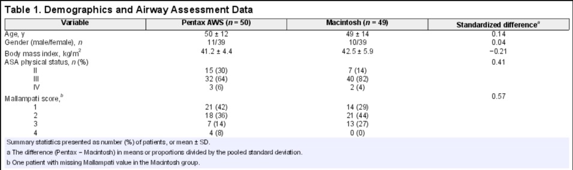]

+ What is it like to recreate it?

---
# Load a couple of packages.

```{r}
library(conflicted)
conflict_prefer("select", "dplyr", quiet = TRUE)
conflict_prefer("filter", "dplyr", quiet = TRUE)

conflict_prefer("continuous_summary", "gtsummary", quiet = TRUE)
conflict_prefer("as_flextable", "gtsummary", quiet = TRUE)
conflict_prefer("void", "reactablefmtr", quiet = TRUE)

library(medicaldata)
library(gtable)
suppressPackageStartupMessages(library(gt))
suppressPackageStartupMessages(library(gtsummary))
library(flextable)
library(dplyr)
library(forcats)
library(labelled)
suppressPackageStartupMessages(require(gdtools))
library(officer)
library(smd)
```


---
# Preprocess

```{r}
library(forcats) # for fct_rev()
analysis <- medicaldata::laryngoscope %>%
  mutate(
    male = gender == 1,
    female = gender == 0,
    asa_rm = factor(as.character(as.roman(asa))), # asa as roman numerals
    Mallampati_f = factor(Mallampati, ordered = T)
  ) %>%
  mutate(
    laryngoscope = if_else(
      Randomization == 0,
      "MacIntosh",
      "Pentax AWS"
    ),
    laryngoscope = fct_rev(laryngoscope) # reverse order
  ) %>%
  select(laryngoscope, age, male, female, BMI, asa_rm, Mallampati_f)
```

---
# Add labels from the .blue[`{labelled}`] package.

```{r}
analysis <-
  analysis %>%
  set_variable_labels(
    age = "Age, y",
    male = "Males",
    female = "Females",
    BMI = "Body mass index, kg/m²",
    asa_rm = "ASA physical status, n (%)",
    Mallampati_f = "Mallampati score,ᵇ"
  )
```

---
# Add a function to calculate the standardized differences.

```{r}
smd_calc <- function(data, variable, by, ...) {
  smd::smd(x = data[[variable]], g = data[[by]], na.rm = TRUE)["estimate"]
}
```

---
# Make the .blue[`{gtsummary}`] table.

+ This is the trickery you saw before, plus we are adding in custom formatting for the continuous variables a new statistic.

.pull-left-60[
```{r, eval=FALSE}
lar_data_gt <- analysis %>%
  tbl_summary(
    by = "laryngoscope",
    statistic = list(all_continuous() ~ "{mean} ± {sd}")
  ) %>%
  add_stat(
    fns = list(
      all_continuous() ~ smd_calc,
      all_categorical() ~ smd_calc
    )
  ) %>%
  modify_header(estimate ~ "Standardized difference ᵃ") %>%
  modify_fmt_fun(update = estimate ~
    function(x) {
      scales::number(x, accuracy = 0.01)
    })

lar_data_gt
```
]

.pull-right-36[
.small[
```{r, echo=FALSE}
lar_data_gt <- analysis %>%
  tbl_summary(
    by = "laryngoscope",
    statistic = list(all_continuous() ~ "{mean} ± {sd}")
  ) %>%
  add_stat(fns = list(
    all_continuous() ~ smd_calc,
    all_categorical() ~ smd_calc
  )) %>%
  modify_header(estimate ~ "Standardized difference ᵃ") %>%
  modify_fmt_fun(update = estimate ~
    function(x) {
      scales::number(x, accuracy = 0.01)
    })
lar_data_gt
```
]]

---
# .blue[`{gtsummary}`] Plays Well with Others...

This is optimized for Word....

.small[
```{r}
# Convert to flextable + additional customization:
big_border <- fp_border(color = "black", width = 2) # create bold border type
fontname <- "Avenir Next Condensed" # create font closely matching manuscript

flex <-
  as_flex_table(
    lar_data_gt,
  ) %>%
  delete_part(part = "footer") %>%
  add_header_lines(values = "Table 1. Demographics and Airway Assessment Data") %>%
  add_footer_lines(values = "Summary statisticis presented as number (%) of patients , or mean ± SD.
  a The difference (Pentax - Macintosh) in means or proportions divided by the pooled standard deviation.
  b One Patient with missing Mallampati value in the Macintosh group.") %>%
  bg(bg = "Light Grey", i = 2, part = "header") %>%
  fontsize(i = 1, size = 14, part = "header") %>%
  bold(part = "header") %>%
  bg(bg = "lavender", part = "footer") %>%
  border_remove() %>%
  surround(i = 2, j = 1:4, border = big_border, part = "header") %>%
  font(fontname = fontname, part = "all") %>%
  line_spacing(space = 1.5, part = "footer") %>%
  line_spacing(space = .3, part = "body")
```
]

---
# Strong `flex`... Suboptimal in .blue[`{xaringan}`]

```{r}
flex
```

---
# Strong `flex` Rendered in HTML

.center[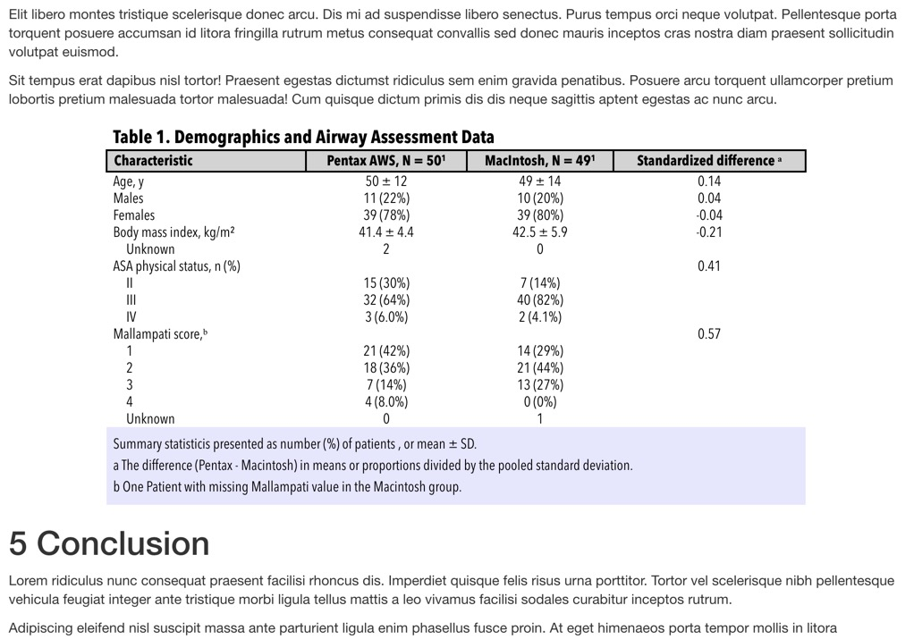]

---
# Add Some .blue[`{rUM}`]

.pull-left-36[
.center[]
]
.pull-right-60[
.small[
+ Your R-loving friends at the University of Miami made a package called rUM https://raymondbalise.github.io/rUM/
+ It has a function .blue[`rUM::make_project()`] that will make an RStudio project that contains:
    + An R Markdown file that has an academic paper shell 
    + A bibliography file for used R packages
    + A `.gitignore` file designed to help protect data leakage
]]

---
### rUM + Word
.pull-left[
With a tiny tweak to the output, you get a word document.

```
---
title: "Analysis of medicaldata::laryngoscope"
author: "Raymond R. Balise and Lauren Nahodyl"
date: "`r Sys.Date()`"
output: 
  rmarkdown::word_document
bibliography: [packages.bib]
csl: the-new-england-journal-of-medicine.csl
---
```
]
.pull-right[
.center[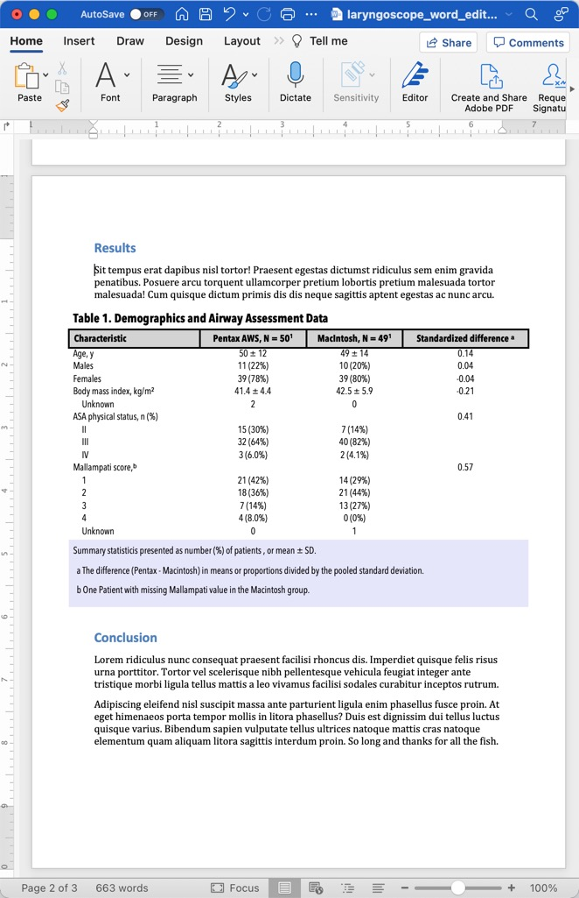]
]

---
# References - HTML

If I am making HTML output, I typically make a custom title, in a different font and color. I add a "tag" to that title, then link to it.

In your Rmd files, you can reference tables with Markdown like:  
`[Table 6.1](#tab:tab6-1)`

.pull-left[
.center[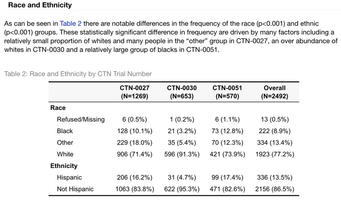]
]
.pull-right[
<br>.
.center[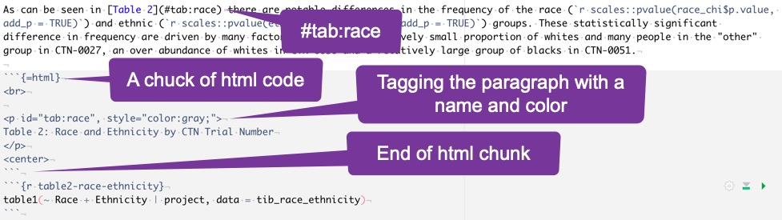]
]

---
# References - Work with the .blue[`bookdown`] Package

+ If you are writing to Word or PDFs, you can use the built-in R Markdown tools for creating links.  
+ You will want to change the output type to use the `bookdown` package.
```
output:
  - bookdown::html_document2
  - bookdown::pdf_document2
  - bookdown::word_document2
```
+ You can label tables with captions and then use `\@ref(label)` to refer to them.

---
# Using .blue[`kable`] or .blue[`flextable`]

.small[
After changing the output to be bookdown, name a code chunk with a name like _simple-example_

```{r simple-example}
wide %>%
  knitr::kable(
    caption = "The raw religon data printed with kable."
  )
```

Then reference the name of the table with code like this:

```
The simple kable example: \@ref(tab:simple-example)
```
]

---
# Word with Table Reference

.pull-left[
.center[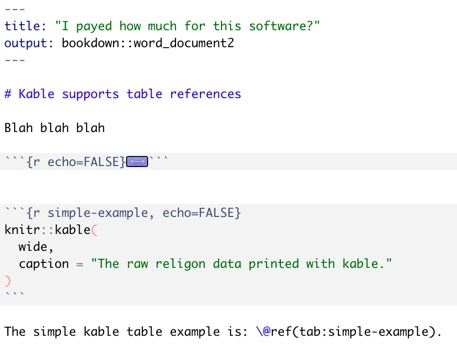]
]
.pull-right[
.center[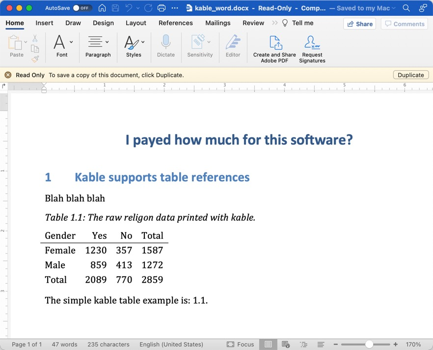]
]

---
class:segue

# Be Dynamic

```{r echo=FALSE}
library(forcats) # for fct_rev()
analysis <- medicaldata::laryngoscope %>%
  mutate(
    male = gender == 1,
    female = gender == 0,
    asa_rm = factor(as.character(as.roman(asa))), # asa as roman numerals
    Mallampati_f = factor(Mallampati, ordered = T)
  ) %>%
  mutate(
    laryngoscope = if_else(
      Randomization == 0,
      "MacIntosh",
      "Pentax AWS"
    ),
    laryngoscope = fct_rev(laryngoscope) # reverse order
  ) %>%
  select(laryngoscope, age, male, female, BMI, asa_rm, Mallampati_f)
```

Static tables are so last century!

---
# Dynamic Tables

+ There are two excellent packages for making dynamic tables, .blue[`DT`] and .blue[`reactable`]
+ .blue[`DT`] is widely used.
+ .blue[`reactable`] is new(ish) but it is built on top of React which is a **huge** deal (it is made by Facebook/Meta).

---
# .blue[`DT`]

+ With .blue[`DT`] you get a fully interactive set of controls.

.small[
.scroll-box-16[
```{r}
set.seed(123)
the_start <-
  medicaldata::laryngoscope %>%
  slice_head(n = 100)

the_start %>%
  DT::datatable()
```
]]

---
# .blue[`reactable`]

+ With .blue[`reactable`] you also get dynamic displays with controls.


.small[
.scroll-box-16[
```{r}
the_start %>%
  reactable::reactable()
```
]]

---
# Favorite .blue[`reactable`] Featuers 

+ The ability to collapse/expand groups
+ Embed graphics

---
# Grab a Few Variables

```{r load-react-data}
lar_data <- as_tibble(medicaldata::laryngoscope) %>% #
  mutate(
    Sex =
      case_when(
        gender == 1 ~ "Male",
        gender == 0 ~ "Female"
      )
  ) %>%
  mutate(
    Laryngoscope =
      if_else(Randomization == 0, "MacIntosh", "Pentax AWS")
  ) %>%
  mutate( 
    # asa as roman numerals to match the table. This messes with sorting.
    asa_rm = factor(as.character(as.roman(asa)), levels = c("II", "III", "IV"), ordered = TRUE)
  ) %>%
  mutate(
    Mallampati_f = factor(Mallampati, ordered = T) # as factor and ordered
  ) %>%
  mutate(Time = round(total_intubation_time)) %>%
  rename(
    `American Society of Anesthesiologists physical status` = asa_rm
  ) %>%
  select(Laryngoscope, Time, `American Society of Anesthesiologists physical status`, Sex) %>% 
  arrange(
      "Laryngoscope", "American Society of Anesthesiologists physical status"
    )
```

---
# Subgroups $_1$

.small[
.scroll-box-20[
```{r subgroups-show, eval=FALSE}
library(reactable)
lar_data %>%
  reactable(
    groupBy = c(
      "Laryngoscope",
      "American Society of Anesthesiologists physical status"
    ),
    defaultSorted = c(
      "Laryngoscope",
      "American Society of Anesthesiologists physical status"
    )
  )
```
]]

---
# Subgroups $_2$

.small[
.scroll-box-20[
```{r subgroups-run, echo=FALSE}
library(reactable)
lar_data %>%
  reactable(
    groupBy = c(
      "Laryngoscope",
      "American Society of Anesthesiologists physical status"
    ),
    defaultSorted = c(
      "Laryngoscope",
      "American Society of Anesthesiologists physical status"
    )
  )
```
]]


---
# Agregate data $_1$

.small[
.scroll-box-20[
```{r, eval=FALSE}
lar_data %>%
  reactable(
    groupBy = c(
      "Laryngoscope",
      "American Society of Anesthesiologists physical status"
    ),
    defaultSorted = c(
      "Laryngoscope",
      "American Society of Anesthesiologists physical status"
    ),
    columns = list(
      `American Society of Anesthesiologists physical status` =
        colDef(
          aggregate = "frequency"
        ),
      Sex = colDef(
        aggregate = "frequency"
      ),
      Time = colDef(
        aggregate = "mean", format = colFormat(digits = 0)
      )
    )
  )
```
]]

---
# Agregate data $_2$

.small[
.scroll-box-20[
```{r echo=FALSE}
lar_data %>%
  reactable(
    groupBy = c(
      "Laryngoscope",
      "American Society of Anesthesiologists physical status"
    ),
    defaultSorted = c(
      "Laryngoscope",
      "American Society of Anesthesiologists physical status"
    ),
    columns = list(
      `American Society of Anesthesiologists physical status` =
        colDef(
          aggregate = "frequency"
        ),
      Sex = colDef(
        aggregate = "frequency"
      ),
      Time = colDef(
        aggregate = "mean", format = colFormat(digits = 0)
      )
    )
  )
```
]]

---
## Add Art With or Without .blue[`{reactablefmtr}`] $_1$

.small[
.scroll-box-20[
```{r, eval=FALSE}
library(htmltools)
library(reactablefmtr)

lar_data %>%
  reactable(
    groupBy = c(
      "Laryngoscope",
      "American Society of Anesthesiologists physical status"
    ),
    defaultSorted = c(
      "Laryngoscope",
      "American Society of Anesthesiologists physical status"
    ),
    columns = list(
      `American Society of Anesthesiologists physical status` =
        colDef(
          aggregate = "frequency"
        ),
      Sex = colDef(
        aggregate = "frequency"
      ),
      Time = colDef(
        aggregate = "mean", format = colFormat(digits = 0),
        cell = data_bars(data = ., text_position = "outside-base")
      )
    )
  )
```
]]


---
## Add Art With or Without .blue[`{reactablefmtr}`] $_2$

.small[
.scroll-box-20[
```{r echo=FALSE}
library(htmltools)
library(reactablefmtr)

lar_data %>%
  reactable(
    groupBy = c(
      "Laryngoscope",
      "American Society of Anesthesiologists physical status"
    ),
    defaultSorted = c(
      "Laryngoscope",
      "American Society of Anesthesiologists physical status"
    ),
    columns = list(
      `American Society of Anesthesiologists physical status` =
        colDef(
          aggregate = "frequency"
        ),
      Sex = colDef(
        aggregate = "frequency"
      ),
      Time = colDef(
        aggregate = "mean", format = colFormat(digits = 0),
        cell = data_bars(data = ., text_position = "outside-base")
      )
    )
  )
```
]]

---
# I expect incredible things from .blue[`reactable`].

+ Expect crazy fast performance and beautiful magic.
+ Explore: https://glin.github.io/reactable/articles/examples.html
  + The [Grouping and Aggregation](https://glin.github.io/reactable/articles/examples.html#grouping-and-aggregation) example is like whoa.  `r emo::ji("heart_eyes")`
  + The [embedding of html widgets](https://glin.github.io/reactable/articles/examples.html#embedding-html-widgets) is like my brain goes ... `r emo::ji("boom")`.
+ Watch for add-on packages like https://kcuilla.github.io/reactablefmtr/index.html

---
# Where to Learn More

Gina Reynolds, author of the .blue[`flextable`] package, has made great tutorials:

+ kableExtra: https://evamaerey.github.io/tables/kableextra.html

+ gt: https://evamaerey.github.io/tables/gt.html

+  huxtable: https://evamaerey.github.io/tables/huxtable.html
